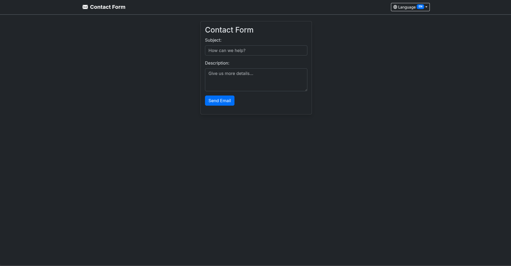

# PHP Mail Contact Form



A simple yet functional PHP contact form application that allows users to send emails through a web interface using PHPMailer and Gmail SMTP.

## 📋 Overview

This project demonstrates a basic contact form implementation with the following features:

- Clean, responsive Bootstrap 5 UI with dark theme
- Form validation and user input handling
- SMTP email sending using PHPMailer library
- Gmail SMTP integration
- Component-based PHP structure

## 🏗️ Project Structure

```
mails/
├── components/
│   └── input.php          # Reusable form input component
├── libs/
│   ├── composer.json       # PHP dependency management
│   ├── composer.lock       # Locked dependencies
│   └── vendor/            # Composer dependencies (PHPMailer)
├── .env                   # Environment variables (excluded from git)
├── .gitignore            # Git ignore rules
├── index.php             # Main contact form page
├── send.php              # Email sending logic
└── README.md             # This documentation
```

## 🚀 Features

- **Responsive Design**: Built with Bootstrap 5, works on all device sizes
- **Dark Theme**: Modern dark interface for better user experience
- **Component Architecture**: Reusable PHP components for maintainability
- **SMTP Integration**: Uses Gmail SMTP for reliable email delivery
- **Error Handling**: Proper exception handling for email sending failures
- **Security**: Environment variables for sensitive credentials

## 🛠️ Technologies Used

- **PHP**: Server-side scripting language
- **PHPMailer**: Popular email sending library for PHP
- **Bootstrap 5**: CSS framework for responsive design
- **Composer**: Dependency management for PHP
- **Gmail SMTP**: Email delivery service

## 📦 Dependencies

The project uses the following PHP packages managed by Composer:

```json
{
  "require": {
    "phpmailer/phpmailer": "^7.0"
  }
}
```

## ⚙️ Setup Instructions

### Prerequisites

- PHP 7.0 or higher
- Composer installed
- Gmail account with App Password enabled
- Web server (Apache, Nginx, or PHP built-in server)

### Installation Steps

1. **Clone or download the repository**

   ```bash
   git clone <repository-url>
   cd mails
   ```

2. **Install dependencies**

   ```bash
   cd libs
   composer install
   cd ..
   ```

3. **Configure environment variables**
   - Copy `.env.example` to `.env` (if not exists)
   - Update the `.env` file with your Gmail App Password:

   ```
   MAIL_PASSWORD=your_gmail_app_password
   ```

4. **Gmail App Password Setup**
   - Enable 2-factor authentication on your Gmail account
   - Go to Google Account settings → Security → App Passwords
   - Generate a new app password for this application
   - Use this password in your `.env` file

5. **Update email credentials in `send.php`**
   - Modify the SMTP settings with your Gmail credentials:

   ```php
   $mail->Username   = 'your_email@gmail.com';
   $mail->Password   = 'your_app_password';
   $mail->setFrom('sender_email@gmail.com', 'Your Name');
   $mail->addAddress('recipient_email@gmail.com', 'Recipient Name');
   ```

6. **Run the application**
   ```bash
   php -S localhost:8000
   ```
   Or deploy to your web server's document root.

## 🔧 Configuration

### SMTP Settings (in `send.php`)

```php
$mail->Host       = 'smtp.gmail.com';        // SMTP server
$mail->SMTPAuth   = true;                    // Enable SMTP authentication
$mail->Username   = 'your_email@gmail.com';  // SMTP username
$mail->Password   = 'your_app_password';      // SMTP password
$mail->SMTPSecure = PHPMailer::ENCRYPTION_SMTPS;  // TLS encryption
$mail->Port       = 465;                      // TCP port
```

### Form Customization

The contact form can be easily customized by modifying the `renderInput` calls in `index.php`:

```php
renderInput([
    'label' => 'Custom Field',
    'name'  => 'custom_field',
    'placeholder' => 'Enter your value...',
    'type' => 'email',  // or 'text', 'number', etc.
    'isTextArea' => false  // or true for textarea
]);
```

## 📁 File Descriptions

### `index.php`

- Main application entry point
- Renders the contact form using Bootstrap 5
- Includes the reusable input component
- Handles form submission to `send.php`

### `send.php`

- Processes form submissions
- Configures and sends emails using PHPMailer
- Handles success/error responses
- Redirects back to the form after sending

### `components/input.php`

- Reusable form input component
- Supports both text inputs and textareas
- Generates Bootstrap-styled form elements
- Configurable through props array

### `.env`

- Stores sensitive configuration
- Contains email credentials
- Excluded from version control for security

### `.gitignore`

- Excludes sensitive files and dependencies
- Prevents `.env` and `vendor/` from being committed

## 🔒 Security Considerations

- **Environment Variables**: Sensitive credentials are stored in `.env` file
- **Input Validation**: Consider adding server-side validation for form inputs
- **CSRF Protection**: Implement CSRF tokens for form submissions
- **Rate Limiting**: Add rate limiting to prevent spam abuse

## 🐛 Troubleshooting

### Common Issues

1. **Email not sending**
   - Verify Gmail App Password is correct
   - Check if 2-factor authentication is enabled
   - Ensure SMTP settings are correct

2. **Composer errors**
   - Make sure Composer is installed
   - Check PHP version compatibility
   - Run `composer update` if needed

3. **Form not submitting**
   - Check file permissions
   - Verify PHP error logs
   - Ensure web server is configured correctly

### Debug Mode

To enable detailed SMTP debugging, modify `send.php`:

```php
$mail->SMTPDebug = SMTP::DEBUG_SERVER;  // Enable verbose debug output
```

## 📄 License

This project is provided as-is for educational purposes. Feel free to modify and use it according to your needs.

## 🤝 Contributing

Contributions are welcome! Please feel free to submit pull requests or open issues for any bugs or feature requests.

## 📞 Support

For any questions or issues, please refer to the troubleshooting section or open an issue in the repository.
